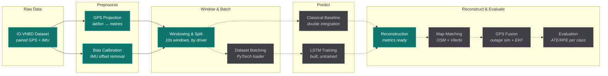

<div align="center">

# Reckon-AI

**Keeping a vehicle on the map when GPS disappears.**

Learned inertial odometry for GPS-denied ground-vehicle positioning — estimating where a car
actually went, using nothing but the motion sensors already inside a smartphone.

[](https://github.com/jeevansai-hub/Reckon-AI/actions/workflows/ci.yml)
[](https://www.python.org/)
[](LICENSE)
[](https://github.com/onyekpeu/IO-VNBD)

</div>

---

## The problem

GPS is the backbone of every navigation system — and its single point of failure. In a tunnel,
an underground car park, or a dense urban canyon, the signal is simply gone. Today's maps respond
by **freezing** at the last known point, then **jumping** when the signal returns, precisely at the
moments accuracy matters most: a motorway exit, a complex interchange.

The classical fallback, *dead reckoning*, integrates accelerometer readings twice to recover
position. On cheap consumer sensors this fails fast — a tiny constant bias compounds into error
that grows with the **square of elapsed time**, drifting tens to hundreds of metres within a single
minute.

This project takes the learned approach instead: train a sequence model on real driving data to map
noisy smartphone IMU signals directly to true displacement, then measure — honestly, per road type —
how much better it does than classical integration on drives it has never seen.

## Status

> [!IMPORTANT]
> **The data pipeline is built and verified against all 72 real dataset runs. No model has been
> trained yet, so there are no accuracy numbers to report.** Everything claimed below as "built"
> is tested and running; everything marked "not built" is an empty placeholder module. This
> distinction is kept deliberately explicit — see [What's built](#whats-built) for the exact line.

## Pipeline



**Solid = built and tested · dashed = not implemented yet.**
An interactive version (pan/zoom, dark/light, export) lives at
[`reports/pipeline-architecture.html`](reports/pipeline-architecture.html).

## Quick start

```bash
# 1. Install (editable, with dev tools)
pip install -e ".[dev]"

# 2. Confirm the environment works — needs no dataset
pytest tests/test_model_smoke.py -v

# 3. Fetch the dataset (~2.2 GB over Git LFS)
git lfs install
git clone https://github.com/onyekpeu/IO-VNBD.git data/IO-VNBD
cd data/IO-VNBD && git lfs pull && cd ../..

# 4. Verify the data is real, complete, and matches the schema
python scripts/verify_schema.py
python scripts/explore_dataset.py
```

Step 4 is not optional — it has already caught two real bugs (see [Dataset](#dataset)).
Full walkthroughs live in [`.agent/workflows/`](.agent/workflows/).

> On Windows, prefix data scripts with `PYTHONIOENCODING=utf-8` and invoke tools as
> `python -m pytest` / `python -m ruff` if console encoding or PATH gets in the way.

## Dataset

[**IO-VNBD**](https://github.com/onyekpeu/IO-VNBD) (Inertial and Odometry Vehicle Navigation
Benchmark Dataset) — real driving recorded across the UK, Nigeria, and France, with a
research-grade GPS/CAN-bus stream and a smartphone IMU stream captured **simultaneously**, so every
noisy sensor window has a trustworthy ground-truth answer.

Chosen over the more commonly cited RoNIN and OxIOD because those are largely pedestrian-carried;
IO-VNBD is vehicle-mounted, which is what this problem actually is.

Verified locally across every run — these are the known-good numbers, and any deviation means an
incomplete download:

| Property | Verified value |
|---|---|
| Synchronised runs loaded | **72 / 72**, zero failures |
| Missing IMU values | **0** across all runs |
| Sample interval | **exactly 0.1 s (10 Hz)**, zero variance |
| Total distance | **~1,344 km** |
| Total driving time | **~29.7 hours** |
| Driver E share | **89% of runs, 67% of distance** |

Two bugs this verification caught, both of which would have silently corrupted results rather
than crashing:

- **Swapped orientation columns.** The documented schema had `pitch` and `roll` reversed relative
  to the real CSV order. Nothing would have errored — the data would just have been wrong.
- **A mis-encoded `m/s²` byte** in every S-file header crashed `pd.read_csv` on 100% of runs, but
  only surfaced when loading files in bulk, never when testing a single hand-picked file.

The heavy single-driver skew is why the train/val/test split holds out **whole driver groups**.
A random row split would leak near-duplicate adjacent windows across the boundary and produce
fake-good accuracy.

## What's built

| Stage | Module | Status |
|---|---|---|
| Load a synchronised run pair | `io_vnbd.data.loader`, `.schema` | ✅ verified on 72 runs |
| GPS → local metric frame | `io_vnbd.data.projection` | ✅ |
| IMU bias calibration | `io_vnbd.data.bias` | ✅ |
| Windowing + driver-based split | `io_vnbd.data.windowing` | ✅ |
| LSTM architecture | `io_vnbd.models.lstm` | ✅ built, **untrained** |
| ATE / RPE metrics | `io_vnbd.evaluation.metrics` | ✅ tested, no predictions to score yet |
| Data verification tooling | `scripts/verify_schema.py`, `scripts/explore_dataset.py` | ✅ |
| Batching for training | `io_vnbd.datasets.torch_dataset` | ❌ placeholder |
| Training loop | `io_vnbd.training.train` | ❌ placeholder |
| Classical baseline | `io_vnbd.baseline.dead_reckoning` | ❌ placeholder |
| Road-network map-matching | `io_vnbd.mapmatch.matcher` | ❌ placeholder |
| GPS-outage fusion (EKF) | `io_vnbd.fusion.ekf` | ❌ placeholder |

## Method

**Input** — a 10-second window (100 samples at 10 Hz) of gravity-corrected accelerometer and
gyroscope readings: 6 channels × 100 timesteps.
**Output** — the vehicle's 2-D displacement `(dx, dy)` in metres over that window.
**Learning** — MSE against GPS-derived ground truth, Adam optimiser. Full-drive trajectories are
reconstructed by cumulatively summing per-window predictions.

**Evaluation** uses two standard trajectory metrics from the robotics literature, reported
**per driving category rather than as one blended average**, and always against the classical
baseline — a number like "15 m error" means nothing without knowing what the naive method scored
on the same drive.

- **ATE** (Absolute Trajectory Error) — how far the whole reconstructed drive drifted from reality.
- **RPE** (Relative Pose Error) — how much error accumulates over a fixed short interval,
  independent of drift accrued earlier.

Two extensions bound the drift further, both planned:
**map-matching** (a vehicle cannot be inside a building, so snap the estimate onto the OSM road
graph via HMM + Viterbi) and **fusion** (blend back to GPS over a 2–5 s window on reacquisition, so
the position never visibly jumps).

## Roadmap

- [x] Dataset acquisition, schema verification, full-dataset EDA
- [x] Preprocessing: projection, bias calibration, windowing, leakage-free split
- [ ] **Next:** classical baseline + training loop, built in parallel — the baseline needs no
      training time, so a comparison number exists even if training runs long
- [ ] First trained model and honest per-category ATE/RPE against the baseline
- [ ] Map-matching against an OSM extract (UK runs — best map coverage of the three countries)
- [ ] Simulated 1 km GPS outage with smooth EKF resync
- [ ] Judge-facing demo: true path vs. baseline vs. model, one plot

## Repository layout

```
├── src/io_vnbd/        # the installable package — one subpackage per pipeline stage
│   ├── data/           # loader, schema, projection, bias, windowing
│   ├── datasets/       # PyTorch batching            (placeholder)
│   ├── models/         # LSTM architecture
│   ├── baseline/       # classical dead reckoning    (placeholder)
│   ├── mapmatch/       # OSM + HMM/Viterbi           (placeholder)
│   ├── fusion/         # outage simulation + EKF     (placeholder)
│   ├── evaluation/     # ATE / RPE metrics
│   └── training/       # training loop               (placeholder)
├── configs/            # split categories, hyperparameters, output paths (YAML)
├── scripts/            # thin CLI entrypoints — no logic lives here
├── tests/              # mirrors src/io_vnbd/ 1:1
├── notebooks/          # exploration
├── reports/            # generated EDA tables, plots, diagrams
├── data/IO-VNBD/       # the dataset (gitignored — never committed)
├── models/             # trained checkpoints (gitignored)
├── Project-Context/    # deep project + dataset documentation
└── .agent/workflows/   # repeatable task playbooks
```

<details>
<summary><b>Working with the pipeline directly (code examples)</b></summary>

```python
from pathlib import Path
from io_vnbd.data.loader import load_run
from io_vnbd.data.projection import project_to_local_xy
from io_vnbd.data.bias import combined_bias, apply_bias_correction
from io_vnbd.data.windowing import make_windows

root = Path("data/IO-VNBD/Synchronised V abd S datasets/Categorised IOVNB Dataset")

# 1. Load a matched vehicle/phone pair
v_df, s_df = load_run(root, "S1")

# 2. Ground truth: lat/lon degrees are not linear distance, so project to metres
xy = project_to_local_xy(v_df["lat"], v_df["lon"])

# 3. Remove the constant IMU offset, measured from the two stationary runs
s_df = apply_bias_correction(s_df, combined_bias(root))

# 4. Cut into labelled training windows
windows = make_windows(s_df, xy, run_name="S1", window_size=100, stride=50)
```

Scoring a reconstructed trajectory:

```python
from io_vnbd.evaluation.metrics import (
    integrate_trajectory, absolute_trajectory_error, relative_pose_error,
)

pred = integrate_trajectory(predicted_displacements)
true = integrate_trajectory(true_displacements)

print("ATE:", absolute_trajectory_error(pred, true))
print("RPE:", relative_pose_error(pred, true, delta=10))
```

Report these **per category** (`S`, `M`, `Y`, `Vf`, `Vta`, `Vtb`, `Vw`) — that separation is the
entire reason the dataset is organised this way.

</details>

<details>
<summary><b>Development</b></summary>

```bash
pip install -e ".[dev]"     # editable install + pytest, ruff
pre-commit install          # auto-lint and format on every commit
ruff check src tests scripts
pytest tests/test_model_smoke.py -v
```

CI runs lint and the data-free tests on every push. Settings that drive experiments
(split categories, window size, model hyperparameters) live in `configs/*.yaml`, not in
source — change an experiment by editing YAML, not by hunting through code.

Two conventions worth respecting:

- **`scripts/` holds entrypoints only.** All logic belongs in `src/io_vnbd/`, so it stays
  importable and testable.
- **Never switch the split to random rows.** Adjacent windows within one drive are near-duplicates;
  splitting by whole driver/route group is what keeps the evaluation honest.

</details>

## Documentation

| Document | Contents |
|---|---|
| [`Project-Context/00-PROJECT-CONTEXT.md`](Project-Context/00-PROJECT-CONTEXT.md) | The full picture: problem background, design decisions and their rationale, risks |
| [`Project-Context/IO-VNBD-Repository-Breakdown.md`](Project-Context/IO-VNBD-Repository-Breakdown.md) | Exhaustive dataset reference — every file, folder, and CSV column |
| [`.agent/workflows/`](.agent/workflows/) | Task playbooks: environment setup, data verification |

## Acknowledgements

Built on the **IO-VNBD** dataset by Onyekpe et al. (Coventry University). Please credit the original
authors in any work derived from this repository; the dataset is not redistributed here.

Approach informed by **IONet** (Chen et al., 2018) and **RoNIN** (Yan et al., 2019) on learned
inertial odometry, and **Newson & Krumm (2009)** on HMM map matching.

## License

[MIT](LICENSE) — this project's own code. The IO-VNBD dataset carries its own terms; confirm those
with its authors before any use beyond research.
